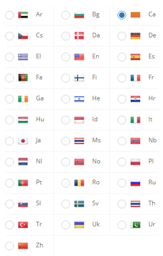

# CWP-Catala
 Traducció al català del [Control Web Panel](https://control-webpanel.com) de [CentosOs](https://www.centos.org)

## Estructura:

 - **/ca**: Fitxers d'idioma català
 - **/original**: Fitxers del tema d'usuari amb la senyera

## Instal·lació:

Cal enganxar les carpetes en les següents ubicacions:
   
    
    /usr/local/cwpsrv/var/services/users/cwp_lang/ca
    /usr/local/cwpsrv/var/services/users/cwp_theme/original/

Es poden copiar des de la terminal o des de l'Advanced File Manager del panell d'administració del CWP